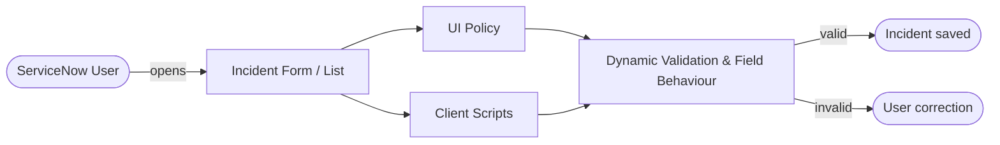
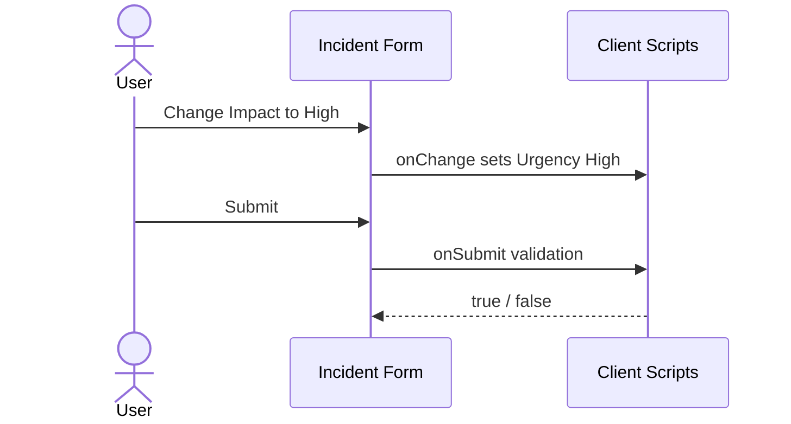

# Solution Architecture
**Project**: Implement Client Script & UI Policy (Incident)  
**Document Reference**: PRJ-INC-P3-003  
**Milestone**: M3 - Design  
**Owner**: Rahul (Team Lead)  
**Status**: Submission Ready

---

## 1. High-Level Architecture

## 2. Layers
| Layer | Components |
| :--- | :--- |
| Presentation | Incident form, Incident list |
| Declarative logic | `High Impact Control` UI Policy + 3 actions |
| Scripted logic | 6 client scripts |
| Data | `incident` table (fields: short_description, category, subcategory, impact, urgency, priority, state, assigned_to, assignment_group) |

## 3. Requirement-to-Implementation Mapping
| Requirement | Component |
| :--- | :--- |
| FR-01 | Script 5 (onSubmit) |
| FR-02 | Script 2 (onChange category) |
| FR-03 | Script 3 (onChange priority) |
| FR-04 | Script 4 (onChange impact) |
| FR-05, FR-06, FR-07, FR-10 | UI Policy + Actions |
| FR-08, FR-09 | Script 6 (onCellEdit) |
| FR-11 | Script 1 (onLoad) |

## 4. Access Model
Controls apply to all users who open the Incident form or list. No role changes are made. Administrators can deactivate any policy or script individually.

## 5. Sequence

