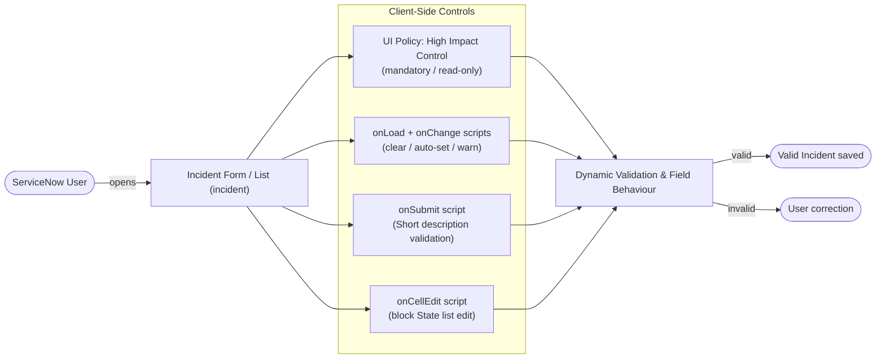
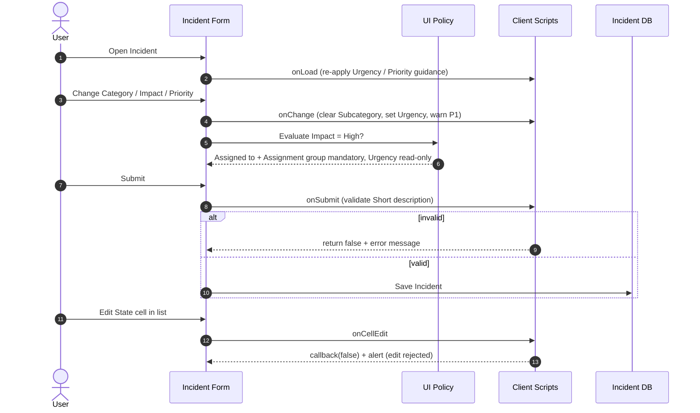

# Implement Client Script & UI Policy (Incident)

[](https://www.servicenow.com)
[](https://developer.servicenow.com)
[](https://docs.servicenow.com)
[](#10-automated-test-verification-suite)

---

## 1. Executive Summary

Incident records are the heart of IT service management, yet data quality on the Incident form is often weak: blank or vague short descriptions, stale subcategories after a category change, inconsistent urgency for high-impact issues, unowned critical incidents, and accidental State changes made from list views.

The **Implement Client Script & UI Policy (Incident)** project solves these problems directly in the browser using ServiceNow client-side controls. **UI Policies** and **UI Policy Actions** provide conditional field behaviour (mandatory / read-only) for High Impact incidents, while **Client Scripts** (`onLoad`, `onChange`, `onSubmit`, `onCellEdit`) provide automatic value population, warnings, save-time validation and list-edit protection.

The solution is a lightweight ServiceNow micro-project focused on practical Incident form controls. No server-side code, integrations or custom tables are required.

---

## 2. Project Team

| Name | Role | Core Responsibility |
| :--- | :--- | :--- |
| **Rahul** | **Team Lead** | Architecture, project coordination, GitHub submission |
| **Dinesh Kumar** | **Member** | UI Policies and UI Policy Actions |
| **Abisheknathan** | **Member** | Client Scripts |
| **Dakshanraj** | **Member** | UAT testing, validation and final report |

---

## 3. Key Objectives

1. **Validate Short description on submit** - block blank or too-short values.
2. **Clear Subcategory when Category changes** - prevent invalid Category/Subcategory pairs.
3. **Warn for Priority 1 - Critical** - show an immediate on-screen warning.
4. **Enforce High Impact UI Policy controls** - `High Impact Control` policy applies mandatory and read-only rules.
5. **Automatically set Urgency to High** when Impact is High.
6. **Require Assigned To (and Assignment group) for High-impact Incidents.**
7. **Block direct State list editing** with an `onCellEdit` script.
8. **Allow State changes through the form** - the form remains the controlled place to change State.
9. **Verify reverse-condition behaviour** - rules switch off when Impact is no longer High.
10. **Provide complete documentation and automated repository verification.**

---

## 4. Architecture & Workflow

### 4.1 High-Level System Architecture



### 4.2 End-to-End Sequence Diagram



---

## 5. Project Structure

```text
servicenow-incident-client-script-ui-policy/
|
|-- README.md                                  # Main project documentation (this file)
|-- .gitignore                                 # Git tracking exclusions
|-- Implement_Client_Script_UI_Policy_Incident_Report.pdf / .docx   # Complete Project Report
|
|-- 01_phase1_ideation/                        # Problem statements, brainstorming, empathy map
|-- 02_phase2_requirements/                    # Journey map, DFD + user stories, requirements, tech stack
|-- 03_phase3_project_design/                  # Problem-solution fit, proposed solution, architecture
|-- 04_phase4_project_planning/                # WBS and planning template
|-- 05_phase5_development_and_testing/
|   |-- 01_implementation_artifacts/
|   |   |-- client_scripts/                    # 6 client scripts (.js)
|   |   |-- ui_policy_high_impact_control.json # UI Policy + Actions definition
|   |   |-- ui_policy_specs.md
|   |   `-- client_script_specs.md
|   `-- 02_uat_testing/                        # UAT plan and execution sheet
|-- 06_phase6_project_documentation/           # FSD and final project report
|
|-- scripts/
|   `-- setup_ui_policy.js                     # Background script to create the UI Policy + Actions
|-- docs/
|   |-- IMPLEMENTATION_GUIDE.md                # Click-by-click ServiceNow setup
|   |-- TEST_CASES.md                          # QA test case matrix
|   `-- images/                                # Architecture and sequence diagrams
|-- live_execution_proofs/                     # Add your ServiceNow screenshots here
|-- phasewise_deliverables_docx_and_pdf/       # DOCX + PDF of every document
`-- automated_tests/
    |-- test_repository.py                     # Repository verification suite
    `-- client_script_simulation.js            # Offline logic test of the client scripts
```

---

## 6. Milestones & Implementation Details

### Milestone 1: Project Ideation and Problem Definition
- **Objective:** Define the Incident data-quality problem, scope, title and team responsibilities.
- **Deliverables:** Problem statement, objectives, team matrix and scope (`01_phase1_ideation/`).

### Milestone 2: Requirements Analysis
- **Objective:** Define mandatory/read-only behaviour, dependent fields, validation, warnings and list-edit restrictions.
- **Deliverables:** Functional requirements and user stories (`02_phase2_requirements/`).

### Milestone 3: Architecture and Project Design
- **Objective:** Map every requirement to a UI Policy or a Client Script event type.
- **Deliverables:** Architecture, workflow and implementation mapping (`03_phase3_project_design/`).

| Requirement | Mechanism | Event / Condition |
| :--- | :--- | :--- |
| Validate Short description | Client Script | `onSubmit` |
| Clear Subcategory | Client Script | `onChange` on `category` |
| Warn for Priority 1 - Critical | Client Script | `onChange` on `priority` |
| Auto-set Urgency to High | Client Script | `onChange` on `impact` |
| Require Assigned To / Assignment group | UI Policy Action | Impact is High |
| Lock Urgency while Impact is High | UI Policy Action | Impact is High |
| Block State list edit | Client Script | `onCellEdit` on `state` |
| Reverse-condition behaviour | UI Policy | *Reverse if false* enabled |

### Milestone 4: ServiceNow Implementation
- **Objective:** Configure the `High Impact Control` UI Policy and implement the `onLoad`, `onChange`, `onSubmit` and `onCellEdit` scripts.
- **UI Policy:** table `incident`, condition `Impact is 1 - High`, *On load* and *Reverse if false* enabled.
- **UI Policy Actions:** `assigned_to` mandatory, `assignment_group` mandatory, `urgency` read-only.
- **Deliverables:** Working configuration artifacts (`05_phase5_development_and_testing/01_implementation_artifacts/`).

### Milestone 5: Testing and Verification
- **Objective:** Execute positive and negative UAT scenarios, including reverse-condition behaviour.
- **Deliverables:** UAT plan, test cases and verification suite (`02_uat_testing/`, `docs/TEST_CASES.md`, `automated_tests/`).

### Milestone 6: Documentation, Packaging and GitHub Submission
- **Objective:** Prepare the final report, FSD, PDF/DOCX files and the repository package.
- **Deliverables:** Complete GitHub-ready project.

### Conclusion
The six milestones give a complete path from ideation through requirements, design, implementation, testing, documentation and submission.

---

## 7. Business Impact & Results

The impact below is the **expected qualitative outcome** of the controls. Measure real figures from your own instance after go-live.

| Area | Result |
| :--- | :--- |
| **Data validation** | Client-side checks implemented |
| **Mandatory control** | High-impact Assigned To / Assignment group |
| **Read-only control** | High-impact Urgency |
| **Automation** | Urgency automatically set to High |
| **Dependency control** | Subcategory cleared on Category change |
| **Warning** | Critical Priority warning |
| **Save protection** | Invalid Incident submission blocked |
| **List protection** | State list edit blocked |
| **Documentation** | Complete project package |
| **Verification** | Automated repository checks + UAT plan |

Expected benefits: improved data quality, fewer user-entry errors, better triage/routing consistency, controlled Incident updates and stronger reporting consistency.

---

## 8. Project Documentation & Phasewise Deliverables

* **Phase 1: Ideation (`01_phase1_ideation/`)** - `01_problem_statements.md`, `02_brainstorming_and_prioritization.md`, `03_empathy_map_canvas.md`
* **Phase 2: Requirement Analysis (`02_phase2_requirements/`)** - `01_customer_journey_map.md`, `02_dfd_and_user_stories.md`, `03_solution_requirements.md`, `04_technology_stack.md`
* **Phase 3: Project Design (`03_phase3_project_design/`)** - `01_problem_solution_fit.md`, `02_proposed_solution.md`, `03_solution_architecture.md`
* **Phase 4: Project Planning (`04_phase4_project_planning/`)** - `01_wbs_and_planning_logic.md`, `02_project_planning_template.md`
* **Phase 5: Development & Testing (`05_phase5_development_and_testing/`)** - `ui_policy_specs.md`, `client_script_specs.md`, `ui_policy_high_impact_control.json`, six client scripts, `uat_test_plan_and_execution_report.md`
* **Phase 6: Project Documentation (`06_phase6_project_documentation/`)** - `01_functional_specification_document_fsd.md`, `02_final_project_report.md`

---

## 9. Formatted PDF & DOCX and Deliverable Packages

The complete project report and every phase document are available as **Word (.docx)** and **PDF** files:

- [`Implement_Client_Script_UI_Policy_Incident_Report.pdf`](Implement_Client_Script_UI_Policy_Incident_Report.pdf) / [`.docx`](Implement_Client_Script_UI_Policy_Incident_Report.docx)
- [`phasewise_deliverables_docx_and_pdf/`](phasewise_deliverables_docx_and_pdf/) - one DOCX + PDF per document, grouped by phase

---

## 10. Automated Test Verification Suite

```bash
python automated_tests/test_repository.py
```

Expected result: `PROJECT VERIFICATION: PASS`

The suite checks repository structure, title, team members, UI Policy configuration, client scripts (including an offline logic simulation when Node.js is installed), UAT documentation, the final report, PDF/DOCX deliverables and the verification suite itself.

> The suite complements but does **not** replace live ServiceNow UAT. Execute `05_phase5_development_and_testing/02_uat_testing/` on your instance and attach screenshots to `live_execution_proofs/`.
